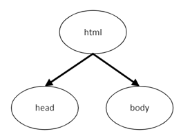

% Copyright 2024 Caroline Blank <caro@c-space.org>
% SPDX-License-Identifier: CC-BY-NC-SA-4.0

```{role} html(code)
:language: html
```

# HTML

Le format **HTML** (**H**yper**T**ext **M**arkup **L**anguage) est un format qui
permet de décrire le contenu et la structure d'une page Web. HTML n'est pas un
langage de programmation, il ne contient ni fonction, ni boucle, ni instruction
conditionnelle, mais c'est un ensemble de balises qui permettent de mettre un
document en page, afin que le navigateur puisse l'afficher correctement.

Les balises ont la forme suivante:

```{code} html
<h1>Bienvenue sur notre site Web</h1>
```

`<h1>` est une balise ouvrante et `</h1>` est une balise fermante. À chaque
balise ouvrante correspond une balise fermante à l'exception des balises qui
n'ont pas de contenu.

## Balise `<!DOCTYPE html>`

Tous documents qui décrivent une page Web doivent débuter par:

```{code} html
<!DOCTYPE html>
```

Ce n'est pas une balise HTML, mais une information qui permet au navigateur de
savoir le type de document.

## Balise `<html>`

Tout le code HTML doit être inséré dans une balise nommée html:
`<html> ... </html>`.
La balise html contient en général deux autres balises:
- `<head> ... </head>`: entête du document, elle contient différentes
  informations concernant le document (titre de la page, type d'encodage, lien
  vers le fichier CSS, etc.). Ces informations ne seront pas affichées à l'écran
  à l'exception du titre affiché sur l'onglet de la page.
- `<body> ... </body>`: contient le contenu (corps) de la page. Tout ce qui sera
  dans cette partie sera affiché.

```{sidebar}

```

```{code} html
:number-lines:
<!DOCTYPE html>
<html>
  <head>
    ...
  </head>
  <body>
    ...
  </body>
</html>
```

## Balise `<body>`

Dans la balise `<body>`, nous allons structurer le contenu de la page. Nous
allons voir les balises les plus simples qui permettent de définir des titres,
sous-titres et paragraphes:
- `<h1> ... </h1>`: permet de définir un titre principal
- `<h2> ... </h2>`: permet de définir un sous-titre
- `<h3> ... </h3>`: permet de définir un sous-sous-titre
- `<h...> ... </h...>`: permet de définir un sous-...-sous-titre
- `<p> ... </p>`: permet de définir un paragraphe

```{sidebar}

```

```{code} html
:number-lines:
<!DOCTYPE html>
<html>
  <head> ... </head>
  <body>
    <h1>Titre principal</h1>
    <p>Vous êtes dans le corps de la page HTML.</p>
  </body>
</html>
```

## Balise `<head>`

La balise `<head>` contient différentes informations sur le document, notamment
le titre de la page et le type d'encodage.

## Balise `<title>`

La balise `<title>` permet de définir le titre de la page qui s'affichera sur
l'onglet du navigateur web.

```{code} html
<title>Ma page</title>
```


## Balise `<meta>`

La balise `<meta>` permet d'indiquer le type d'encodage (ASCII, UTF-8). Nous
souhaitons que les accents s'écrivent correctement sur notre page, nous allons
donc utiliser de l'UTF-8 que nous allons indiquer dans l'attribut charset:

```{code} html
<meta charset="utf-8">
```

Comme cette balise ne contient pas de contenu, c'est une balise unique (pas de
balise ouvrante et fermante).

## Exercice {num2}`exercice`

Notez la balise qui indique:

```{role} input(quiz-input)
:right: width: 12rem;
:check: json trim
```

```{quiz}
:style: max-width: 42rem;
1.  {input}`{"<html>": true}`
    ... le début d'un document HTML?
2.  {input}`{"</h1>": true}`
    ... la fin d'un titre principal?
3.  {input}`{"<head>": true}`
    ... la début de l'entête du document?
4.  {input}`{"</body>": true}`
    ... la fin du contenu (corps) de la page?
5.  {input}`{"<h2>": true}`
    ... le début d'un titre de niveau 2?
6.  {input}`{"</p>": true}`
    ... la fin d'un paragraphe?
7.  {input}`{"<title>": true}`
    ... le début du titre de la page indiqué dans l'onglet?
8.  {input}`{"<meta charset="utf-8">": true, "<meta charset="UTF-8">": true}`
    ... que l'encodage utilisé est l'`utf-8`?
```

## Exercice {num2}`exercice`

Dans quelle partie les balises suivantes se trouvent-t-elles?

```{role} input(quiz-input)
:right: width: 6rem;
:check: json trim
```

```{role} choix(quiz-select)
:right:
:options: |
: <html></html>
: <head></head>
: <body></body>
```

```{quiz}
:style: max-width: 28rem;
1.  {choix}`<body></body>`
    `<p>...</p>`
2.  {choix}`<head></head>`
    `<meta charset="utf-8">`
3.  {choix}`<html></html>`
    `<head>...</head>`
4.  {choix}`<body></body>`
    `<h2>...</h2>`
5.  {choix}`<html></html>`
    `<body>...</body>`
6.  {choix}`<body></body>`
    `<h1>...</h1>`
7.  {choix}`<head></head>`
    `<title>...</title>`
8.  {choix}`<body></body>`
    `<h4>...</h4>`
```

(hyperliens)=
## Hyperliens

La balise `<a>` permet de créer un  hyperlien, c'est-à-dire un texte sur lequel
il faut cliquer pour accéder à une autre page. Il faut indiquer le lien dans
l'attribut href: {html}`<a href="lien">Texte</a>`

```{code} html
:number-lines:
<p>
  Pour accéder au site du collège,
  cliquez <a href="https://www.cscfr.ch/index.php/fr/">ici</a>
</p>
```

Pour ouvrir la nouvelle page dans un nouvel onglet, il faut ajouter l'attribut
`target` avec la valeur `_blank`:

```{code} html
<a href="lien" target="_blank">Texte</a>
```

[Tuto](https://developer.mozilla.org/fr/docs/Web/HTML/Element/a) élément `<a>`.

(listes)=
## Listes

Il existe deux types de listes:

1.  Listes numérotées (ordered) `<ol>`
    ```{code} html
    :number-lines:
    <ol>
      <li>Mettre 1L d'eau dans un casserole</li>
      <li>Porter à ébullition</li>
      ...
    </ol>
    ```
2.  Listes à puces (unordered) `<ul>`
    ```{code} html
    :number-lines:
    <ul>
      <li>Tomates</li>
      <li>Courgettes</li>
      ...
    </ul>
    ```

[Tuto](https://developer.mozilla.org/fr/docs/Web/HTML/Element/li) listes.

(images)=
## Images

La balise `` permet d'insérer une image sur une page Web. Dans l'attribut
`src` (abréviation pour source), il faut indiquer le lien vers l'image, soit une
URL, soit le chemin local.

- {html}`` (dans le même répertoire)
- {html}`` (dans un sous-répertoire)

Cette balise peut contenir aussi les attributs height ou width qui permettent de
déterminer la hauteur et/ou la largeur de l'image en pixels.

```{code} html

```

[Tuto](https://developer.mozilla.org/fr/docs/Learn/HTML/Multimedia_and_embedding/Images_in_HTML)
images.

## Sauts de ligne

La balise `<br>` permet de faire un saut de ligne (break). Comme cette balise ne
contient pas de contenu, c'est une balise unique (pas de balise ouvrante et
fermante).

```{code} html
À la fin de cette ligne, il y aura un saut de ligne. <br>
```

## Tables ou tableaux

La balise `<table>` permet de représenter des tableaux de données (tableaux en
  deux dimensions). Les tableaux peuvent aussi être utilisés pour la mise en
  page, par exemple mettre du texte à côté d'une image ou mettre plusieurs
  images l'une à côté de l'autre.

```{code} html
:number-lines:
<table>
  <tr>                        <!-- Première ligne -->
    <th>Ingrédients</th>      <!-- entête première colonne -->
    <th>Quantité</th>         <!-- entête deuxième colonne -->
  </tr>
  <tr>                        <!-- Deuxième ligne -->
    <td>Pommes de terre</td>  <!-- Première colonne -->
    <td>1 kg</td>             <!-- Deuxième colonne -->
  </tr>
  <tr>
    <td>lait</td>
    <td>0.5l</td>
  </tr>
</table>
```

[Tuto](https://developer.mozilla.org/fr/docs/Web/HTML/Element/table) tables et
tableaux

## Exercice {num2}`exercice`

````{tab-set}
:sync-group: etape
```{tab-item} Étape 1
:sync: etape1
Voici le code HTML d'une page simple.

1.  Qu'est-ce que vous comprenez de cette page?
2.  Imaginez-vous à quoi elle va ressembler. Quels éléments vont s'afficher?
3.  Appuyez sur le bouton `Run` pour afficher la page.
```
```{tab-item} Étape 2
:sync: etape2
Modifiez le titre et le premier paragraphe pour remplacer "Collège du Sud"
   par "Collège Sainte-Croix".
```
```{tab-item} Étape 3
:sync: etape3
Modifiez la partie présentation pour avoir les informations qui correspondent à
celles du Collège Sainte-Croix. Changez aussi le lien vers le site de l'école.
(cf. [](#hyperliens))
```
```{tab-item} Étape 4
:sync: etape4
Complétez la liste de vos cours avec: Économie et droit, Biologie, ...
```
```{tab-item} Étape 5
:sync: etape5
Changez la liste de vos cours par une liste numérotée. (cf. [](#listes))
```
```{tab-item} Étape 6
:sync: etape6
Ajoutez un sous-titre "Ma classe" et un paragraphe avec quelques informations.
```
```{tab-item} Étape 7
:sync: etape7
Ajoutez une image du collège en ajustant la largeur. (cf. [](#images))
```
```{tab-item} Étape 8
:sync: etape8
Ajoutez un sous-titre "Mon horaire" et un tableau de votre horaire.
```
```{tab-item} Étape 9
:sync: etape8
Utilisez un tableau pour afficher la présentation du collège à côté de la photo.
```
````

```{exec} html
:editor:
:style: height: 14rem;
<!DOCTYPE html>
<html>
  <head>
    <meta charset="utf-8">
    <title>Nom de la page</title>
  </head>
  <body>
    <h1>Collège du Sud</h1>
    <p>Voici ma première page Web sur le collège du Sud!</p>
    <h2>Présentation</h2>
    <p>Le collège du Sud est un établissement fribourgeois du secondaire du 2e degré. Il offre actuellement 3 filières d’études: un gymnase, une école de commerce et une école de culture générale. Il reçoit des étudiant-e-s de 16 à 20 ans, qui proviennent essentiellement des districts de la Gruyère et de la Veveyse, mais aussi de la Glâne.</p>
    <p id="source">Source: <a href="https://collegedusud.ch" target="_blank">Site internet du collège du Sud</a><p/>
    <h2>Mes cours</h2>
    <ul>
      <li>Français</li>
      <li>Allemand</li>
      <li>Anglais</li>
      <li>Maths</li>
    </ul>
  </body>
</html>
```

````{solution}
```{exec} html
:when: load
:editor:
:style: height: 14rem;
<!DOCTYPE html>
<html>
  <head>
    <meta charset="utf-8">
    <title>Nom de la page</title>
  </head>
  <body>
    <h1>Collège Sainte-Croix</h1>
    <p>Voici ma première page Web sur le collège Sainte-Croix!</p>
    <h2>Présentation</h2>
    <table>
    <tr>
    <td>
    <p>Le collège Sainte_Croix est un établissement fribourgeois du secondaire du 2e degré. Il fait partie
    des trois collèges de la ville de Fribourg avec Gambach et Saint-Michel.</p>
    <p id="source">Source: <a href="https://cscfr.ch" target="_blank">Site internet du collège Sainte-Croix</a><p/>
    </td>
    <td>
    
    </td>
    </tr>
    <table>
    <h2>Mes cours</h2>
    <ol>
      <li>Français</li>
      <li>Allemand</li>
      <li>Anglais</li>
      <li>Maths</li>
      <li>Informatique</li>
      <li>Économie et droit</li>
      <li>Géographie</li>
      <li>Histoire</li>
      <li>Biologie</li>
      <li>Chimie</li>
      <li>Arts visuels ou musique</li>
    </ol>
    <h2>Ma classe</h2>
    <p>Je suis en 1F... La classe est composée de ... filles et ... garçons.</p>
    <h2>Mon horaire</h2>
    <table>
    <tr>
      <th>Heures</th>
      <th>Lundi</th>
      <th>Mardi</th>
      <th>...</th>
    </tr>
    <tr>
      <th>08:05-08:50</th>
      <td>français</td>
      <td>maths</td>
      <td>....</td>
    </tr>
    <tr>
      <th>08:55-09:40</th>
      <td>informatique</td>
      <td>Géographie</td>
      <td>....</td>
    </tr>
    <tr>
      <th>09:45-10:30</th>
      <td>allemand</td>
      <td>économie et droit</td>
      <td>....</td>
    </tr>
  </table>
  </body>
</html>
```

````
