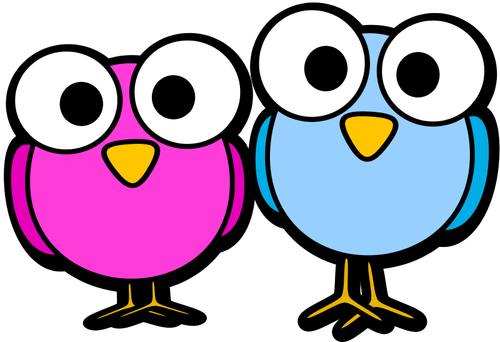
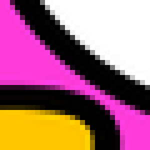
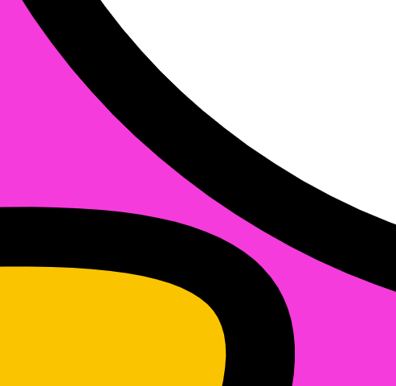

% Copyright 2024 Caroline Blank <caro@c-space.org>
% SPDX-License-Identifier: CC-BY-NC-SA-4.0

# Images

Nous avons vu comment représenter des nombres et des caractères. Maintenant nous
allons nous intéresser aux images.

`````{solution} Activité de découverte
{.lower-alpha-paren}
Par groupe de deux, les élèves doivent décrire leur image avec un minimum
d'information pour qu'un autre groupe puisse la reproduire exactement.

````{list-grid}
:style: grid-template-columns: 1fr 1fr;
-   # Dessin 1
    ```{exec} pnm
    :class: hidden
    :when: load
    P1
    10 10
    0 0 1 1 1 1 1 1 1 1
    0 0 1 1 1 1 1 1 1 1
    1 1 1 1 0 0 1 1 0 0
    1 1 1 1 0 0 1 1 0 0
    1 1 1 1 1 1 0 0 0 0
    1 1 1 1 1 1 0 0 0 0
    1 1 1 1 1 1 1 1 0 0
    1 1 1 1 1 1 1 1 0 0
    0 0 1 1 1 1 1 1 1 1
    0 0 1 1 1 1 1 1 1 1
    ```

-   # Dessin 2
    <svg style="display: block; margin: 1rem auto;" width="300"
     viewBox="0 0 200 200" xmlns="http://www.w3.org/2000/svg">
    <rect x = "0" y = "0" width = "100" height= "100" fill = "#0000FF"/>
    <rect x = "100" y = "0" width = "100" height= "100" fill = "#FF0000"/>
    <circle cx = "100" cy = "100" r ="50" stroke = "black" stroke-width = "4"
        fill = "yellow" fill-opacity="100%" />
    <line x1 = "0" y1 = "0" x2 = "200" y2 = "200" stroke = "red" />
    </svg>


-   # Dessin 3
    <svg style="display: block; margin: 1rem auto;" width="300"
     viewBox="0 0 200 200" xmlns="http://www.w3.org/2000/svg">
    <rect x = "0" y = "0" width = "200" height= "200" stroke-width = "8"
        stroke = "black" fill = "#FF00FF" />
    <rect x = "66.7" y = "66.7" width = "66.7" height= "66.7" stroke-width = "3"
        stroke = "black" fill = "#00FFFF" />
    <rect x = "88.9" y = "88.9" width = "22.2" height= "22.2" stroke-width = "2"
        stroke = "black" fill = "#7F00FF" />
    </svg>

-   # Dessin 4
    ```{exec} pnm
    :class: hidden
    :when: load
    P3
    12 12
    256
    0 0 255 0 0 255 255 0 0 255 0 0 0 255 0 0 255 0 0 0 255 0 0 255 255 0 0 255 0 0 0 255 0 0 255 0
    0 0 255 0 0 255 255 0 0 255 0 0 0 255 0 0 255 0 0 0 255 0 0 255 255 0 0 255 0 0 0 255 0 0 255 0
    0 255 0 0 255 0 0 0 255 0 0 255 255 0 0 255 0 0 0 255 0 0 255 0 0 0 255 0 0 255 255 0 0 255 0 0
    0 255 0 0 255 0 0 0 255 0 0 255 255 0 0 255 0 0 0 255 0 0 255 0 0 0 255 0 0 255 255 0 0 255 0 0
    255 0 0 255 0 0 0 255 0 0 255 0 0 0 255 0 0 255 255 0 0 255 0 0 0 255 0 0 255 0 0 0 255 0 0 255
    255 0 0 255 0 0 0 255 0 0 255 0 0 0 255 0 0 255 255 0 0 255 0 0 0 255 0 0 255 0 0 0 255 0 0 255
    0 0 255 0 0 255 255 0 0 255 0 0 0 255 0 0 255 0 0 0 255 0 0 255 255 0 0 255 0 0 0 255 0 0 255 0
    0 0 255 0 0 255 255 0 0 255 0 0 0 255 0 0 255 0 0 0 255 0 0 255 255 0 0 255 0 0 0 255 0 0 255 0
    0 255 0 0 255 0 0 0 255 0 0 255 255 0 0 255 0 0 0 255 0 0 255 0 0 0 255 0 0 255 255 0 0 255 0 0
    0 255 0 0 255 0 0 0 255 0 0 255 255 0 0 255 0 0 0 255 0 0 255 0 0 0 255 0 0 255 255 0 0 255 0 0
    255 0 0 255 0 0 0 255 0 0 255 0 0 0 255 0 0 255 255 0 0 255 0 0 0 255 0 0 255 0 0 0 255 0 0 255
    255 0 0 255 0 0 0 255 0 0 255 0 0 0 255 0 0 255 255 0 0 255 0 0 0 255 0 0 255 0 0 0 255 0 0 255
    ```
````
`````

## Images vectorielles

Une image vectorielle est composée d'objets géométriques (segments, cercles,
polygones, etc.) définis par des attributs (forme, position, couleur, etc.).
Le fichier contient donc une description des éléments qui composent l'image.
Elle est plutôt utilisée pour représenter des images telles que des icônes ou
des cliparts qui peuvent être représentés par des objets mathématiques et
géométriques.

### Exemple {num2}`exemple`

Encodage d'un image en SVG:

```{code-block} text
<svg width="400" viewBox="0 0 200 200" xmlns="http://www.w3.org/2000/svg">
  <circle cx = "100" cy = "100" r ="80" stroke = "black" stroke-width = "4"
      fill = "yellow" fill-opacity="20%" />
  <rect x = "61" y = "61" width = "78" height= "78" fill = "#00FFFF" />
  <line x1 = "0" y1 = "0" x2 = "200" y2 = "200" stroke = "rgb(121 21 161)" />
  <line x1 = "0" y1 = "0" x2 = "0" y2 = "200" stroke = "rgb(121 21 161)" />
  <line x1 = "0" y1 = "200" x2 = "200" y2 = "200" stroke = "rgb(121 21 161)" />
</svg>
```

Le résultat:

<svg style="display: block; margin: 1rem auto;" width="400"
     viewBox="0 0 200 200" xmlns="http://www.w3.org/2000/svg">
  <circle cx = "100" cy = "100" r ="80" stroke = "black" stroke-width = "4"
     fill = "yellow" fill-opacity="20%" />
  <rect x = "61" y = "61" width = "78" height= "78" fill = "#00FFFF" />
  <line x1 = "0" y1 = "0" x2 = "200" y2 = "200" stroke = "rgb(121 21 161)" />
  <line x1 = "0" y1 = "0" x2 = "0" y2 = "200" stroke = "rgb(121 21 161)" />
  <line x1 = "0" y1 = "200" x2 = "200" y2 = "200" stroke = "rgb(121 21 161)" />
</svg>

Les images vectorielles occupent souvent bien moins d'espace de stockage que les
images matricielles et sont donc également plus rapides à transférer sur les
réseaux informatiques.

## Images matricielles

Une image matricielle est représentée par une grille de points, appelés pixels
("PICTure ELement" => PICTEL => PIXEL), dont chacun a une couleur définie: noir
ou blanc, niveaux de gris ou en couleur avec le système RGB vu au chapitre
précédent. Les pixels sont tellement petits qu'on ne les voit pas à l'oeil nu.

Dans l'image suivante, nous avons sélectionné une toute petite partie:

```{figure} images/image-couleur.png
:alt: Exemple d'image matricelle
:width: 50%
:align: center
```

Encodage d'une image en PPM (Portable PixMap)

```{code-block} text
P3
10 6
255
214 178 64 214 198 48 203 204 45 181 199 50 158 186 61 138 170 73 131 160 90
136 160 115 144 163 125 145 165 127 193 151 57 193 173 45 188 191 47 175 200 56
155 196 67 127 177 76 112 158 92 111 151 121 119 151 137 120 147 138 177 128 49
177 151 38 178 178 41 171 199 51 153 205 61 130 195 73 110 174 90 100 157 115 98
148 130 101 141 136 176 117 57 180 141 48 177 168 44 166 190 45 147 202 48 130
204 62 113 191 83 98 169 106 87 152 116 89 143 127 184 112 75 189 133 69 184 157
60 170 180 53 148 194 50 127 198 55 107 188 73 96 172 98 92 163 116 90 156 128
187 102 83 195 117 84 194 143 82 182 170 77 158 185 70 126 184 60 99 172 68 92
164 96 98 168 124 100 171 141
```

```{exec} pnm
:class: hidden
:when: load
P3
10 6
255
214 178 64 214 198 48 203 204 45 181 199 50 158 186 61 138 170 73 131 160 90 136 160 115 144 163 125 145 165 127
193 151 57 193 173 45 188 191 47 175 200 56 155 196 67 127 177 76 112 158 92 111 151 121 119 151 137 120 147 138
177 128 49 177 151 38 178 178 41 171 199 51 153 205 61 130 195 73 110 174 90 100 157 115 98 148 130 101 141 136
176 117 57 180 141 48 177 168 44 166 190 45 147 202 48 130 204 62 113 191 83 98 169 106 87 152 116 89 143 127
184 112 75 189 133 69 184 157 60 170 180 53 148 194 50 127 198 55 107 188 73 96 172 98 92 163 116 90 156 128
187 102 83 195 117 84 194 143 82 182 170 77 158 185 70 126 184 60 99 172 68 92 164 96 98 168 124 100 171 141
```

Les images matricielles contiennent énormément de pixels, par conséquent elles
occupent rapidement beaucoup d'espace de stockage.


## Agrandissement des images

Comme les images vectorielles sont représentées par des paramètres ou des
équations mathématiques, elles peuvent être agrandies à souhait en recalculant
les courbes dont les équations sont implicitement ou explicitement contenues
dans la représentation vectorielle.

En agrandissant une image matricielle, les pixels deviennent visibles et
l'image devient floue.:

| image originale | image matricielle zoomée | image vectorielle zoomée |
|:---------------:|:------------------------:|:------------------------:|
| | ||

## Format PBM (Portable BitMap)

Le format PBM  est l'un des plus simples pour exprimer des images en noir et
blanc. Un tel fichier contient les informations suivantes dans l'ordre et
séparées par un espace ou un retour à la ligne:

- `P1`

- le nombre de colonnes suivi du nombre de lignes

- la liste des pixels, ligne par ligne, de haut en bas et de gauche à droite.


### Exercice {num2}`exercice`

{.lower-alpha-paren}
1.  Sans convertir l'image, imaginez ce que représente l'image ci-dessous?

```{exec} pnm
:editor:
P1
10 10
0 0 0 0 0 0 0 0 0 0
0 0 1 1 1 1 1 1 0 0
0 1 1 0 0 0 0 1 1 0
0 1 0 0 0 0 0 0 1 0
0 1 0 0 0 0 0 0 1 0
0 1 0 0 0 0 0 0 1 0
0 1 0 0 0 0 0 0 1 0
0 1 1 0 0 0 0 1 1 0
0 0 1 1 1 1 1 1 0 0
0 0 0 0 0 0 0 0 0 0
```

{.lower-alpha-paren}
2.  Vérifiez votre réponse en convertissant l'image.
3.  Modifiez l'image pour remplir le cercle.

### Exercice {num2}`exercice`

Voici une image encodée dans un autre format que PBM, répondez aux trois
questions suivantes avant de convertir l'image:

{.lower-alpha-paren}
1.  Quelles sont les différences avec le format PBM vu précédemment?
2.  Que représentent les valeurs de la deuxième ligne et celle de la troisième ligne?
3.  Que représente l'image dont l'encodage est donné ci-dessous?

```{exec} pnm
P2
8 8
3
3 2 3 3 3 3 2 3
2 2 1 2 2 1 2 2
2 2 2 2 2 2 2 2
1 2 0 2 2 0 2 1
2 2 0 2 2 0 2 2
1 2 2 2 2 2 2 1
3 2 0 1 1 0 2 3
3 3 1 1 1 1 3 3
```

```{solution}
{.lower-alpha-paren}
1.  La première information est `P2` au lieu de `P1`. La description de l'image
    ne contient pas que des 0 et des 1. Elle contient des valeurs entre 0 et 3.
2.  À la deuxième ligne se trouve la largeur et la hauteur de l'image en
    pixels. À la troisième ligne se trouve la valeur maximale acceptée pour la
    description de l'image.
3.  Difficile à déterminer ainsi.
```

### Exercice {num2}`exercice`

Voici une image encodée dans un autre format que PBM, répondez aux questions
suivantes avant de convertir l'image:

{.lower-alpha-paren}
1.  Quelles sont les différences avec les formats vus précédemment?
2.  Quelles sont les dimensions de l'image (largeur et hauteur en pixels)?
3.  Quelle couleur est représentée par la valeur RGB: 255 0 0?
4.  Que représente l'image dont l'encodage est donné ci-dessous?

```{exec} pnm
P3
3 2
255
255 0 0 0 255 0 0 0 255
255 255 0 0 0 0 255 255 255
```

```{solution}
{.lower-alpha-paren}
1.  La première information est `P3`. La description de l'image contient plus de
    valeurs que de lignes/colonnes et elles sont comprises entre 0 et 255.
2.  Les dimensions de l'image sont 3 pixels de large et 2 pixels de haut.
3.  Dans le système RGB, 255 0 0 représente le rouge.
4.  Cette image représente une suite de couleur: rouge, vert, bleu (1ère ligne)
    et jaune, noir, blanc (2ème ligne)
```

## Format PGM (Portable GreyMap)

Le format PBM  est l'un des plus simples pour exprimer des images en noir et
blanc. Un tel fichier contient les informations suivantes dans l'ordre et
séparées par un espace ou un retour à la ligne:

- `P2`

- le nombre de colonnes suivi du nombre de lignes

- la valeur maximale utilisée pour exprimer l'intensité de gris

- la liste des pixels, ligne par ligne, de haut en bas et de gauche à droite.

## Format PPM (Portable PixMap)

Le format PBM  est l'un des plus simples pour exprimer des images en noir et
blanc. Un tel fichier contient les informations suivantes dans l'ordre et
séparées par un espace ou un retour à la ligne:

- `P3`

- le nombre de colonnes suivi du nombre de lignes

- la valeur maximale utilisée pour exprimer l'intensité des couleurs (en général
  255)

- la liste des pixels, ligne par ligne, de haut en bas et de gauche à droite.

### Exercice {num2}`exercice`

L'encodage de l'image ci-dessous à perdu son entête, complétez-le.

Convertissez ensuite l'image pour vérifier votre réponse.

```{exec} pnm
:editor:
# Complétez l'entête
0 0 1 0 0 0 0 0 1 0 0
1 0 0 1 0 0 0 1 0 0 1
1 0 1 1 1 1 1 1 1 0 1
1 1 1 0 1 1 1 0 1 1 1
1 1 1 1 1 1 1 1 1 1 1
0 0 1 1 1 1 1 1 1 0 0
0 0 1 0 0 0 0 0 1 0 0
0 1 0 0 0 0 0 0 0 1 0
```

````{solution}
C'est un image en noir et blanc.
```{exec} pnm
P1
11 8
0 0 1 0 0 0 0 0 1 0 0
1 0 0 1 0 0 0 1 0 0 1
1 0 1 1 1 1 1 1 1 0 1
1 1 1 0 1 1 1 0 1 1 1
1 1 1 1 1 1 1 1 1 1 1
0 0 1 1 1 1 1 1 1 0 0
0 0 1 0 0 0 0 0 1 0 0
0 1 0 0 0 0 0 0 0 1 0
```
````

### Exercice {num2}`exercice`

Observez les données stockées dans le fichier ci-dessous et répondez aux
questions sans convertir l'image:

{.lower-alpha-paren}
1.  Quel est le format de l'image?
2.  Quelles sont les dimensions de cette image?
3.  Que représente le 100 (4ème valeur)?
4.  Y a-t-il une logique dans les valeurs qui représentent l'image? Que peut-on en conclure?

```{exec} pnm
:editor:
P2 6 4 100 0 4 8 12 16 20 24 28 32 36 40 44
48 52 56 60 64 68 72 76 80 84 88 92
```

```{solution}
{.lower-alpha-paren}
1.  `P2` correspond à PGM (Portable Grey Map).
2.  Les dimensions de cette image sont 6 pixels de large et 4 pixels de haut.
3.  Le 100 représente la nuance maximale de gris.
4.  Les valeurs sont croissantes régulièrement, l'image représente un dégradé de
    gris.
```

### Exercice {num2}`exercice`

Reproduisez le coeur de The Legend of Zelda ci-dessous. En respectant les
propriétés suivantes:

- Noir correspond à la nuance 0
- Gris foncé correspond à la nuance 153
- Gris clair correspond à la nuance 204
- Gris très clair correspond à la nuance 230
- Blanc correspond à 255

```{exec} pnm
:after: zelda
:when: load
:class: hidden
```


```{exec} pnm
:editor: 08221482-3cad-4142-b599-bbbe5c4e7c3b
P2
8 7
255
```

````{solution}
```{exec} pnm
:name: zelda
P2
8 7
255
255 0 0 255 0 0 0 255
0 230 204 0 204 204 153 0
0 230 204 204 204 204 153 0
0 204 204 204 204 204 153 0
255 0 204 204 204 153 0 255
255 255 0 153 153 0 255 255
255 255 255 0 0 255 255 255
```
````

### Exercice {num2}`exercice`

Reproduisez Kirby, un personnage de Nintendo. Pour trouver les bonnes couleurs
utilisez la [palette de couleurs](https://htmlcolorcodes.com/color-names/).

```{exec} pnm
:after: kirby
:when: load
:class: hidden
```


```{exec} pnm
:editor: e0545ee7-dcd9-433d-9e2e-e8540420e3db
P3

```

````{solution}
```{exec} pnm
:name: kirby
P3
5 5
255
255 255 255 255 149 184 255 149 184 255 149 184 255 255 255
255 149 184 40 0 255 255 149 184 40 0 255 255 149 184
255 149 184 0 0 0 255 149 184 0 0 0 255 149 184
255 255 255 255 149 184 255 149 184 255 149 184 255 255 255
255 0 85 255 0 85 255 255 255 255 0 85 255 0 85
```
````

### Exercice {num2}`exercice`

À vous de jouer! Créez votre propre image.

Quelques idées: un animal, un emoji, pacman, un fantôme, un goomba, un champignon, ...

[Autres idées](https://www.reddit.com/r/PixelArt/comments/g5h0pz/100_famous_characters_in_8x8_pixels_w_pico8/#lightbox)

[Palette de couleurs](https://htmlcolorcodes.com/color-names/)

```{exec} pnm
:editor: 0293cf50-147d-4245-a94a-11cd75dd62ff

```

