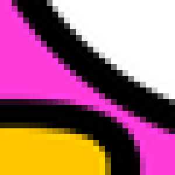
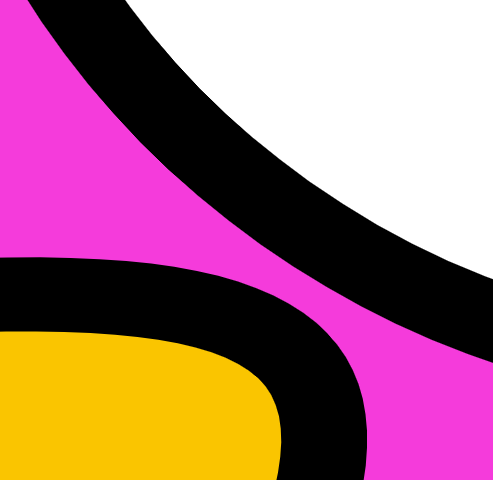

% Copyright 2024 Caroline Blank <caro@c-space.org>
% SPDX-License-Identifier: CC-BY-NC-SA-4.0

# Images

```{metadata}
hide-solutions: true
```

Nous avons vu comment représenter des nombres et des caractères. Maintenant nous
allons nous intéresser aux images.

## Format

Il existe deux types de format d'image:

- le format matriciel ou bitmap (bmp, jpg, gif, png, ...)\
  L'image est composée de points appelés **pixels**[^sn1]. Ceux-ci sont
  tellement petits que nous ne les voyons par à l'oeil nu, mais si nous
  agrandissons l'image, les pixels deviennent visibles et l'image devient floue.
- le format vectoriel (svg, eps, pdf)\
  L'image est composée d'objets géométriques (segments, cercles, polygones,
  etc.) définis par des attributs (forme, position, couleur, etc.). De ce fait,
  une image vectorielle peut être agrandie sans perte de qualité.
[^sn1]: picture element

| image originale | image matricielle zoomée | image vectorielle zoomée |
|:---------------:|:------------------------:|:------------------------:|
| | ||

## Images en noir et blanc

Pour représenter une image en noir et blanc, nous définissons qu'un bit
représente un pixel. S'il est blanc, il prendra la valeur 0, s'il est noir,
la valeur 1.

```{figure} images/image-noir-blanc.png
:alt: Image en noir et blanc
:width: 50%
:align: center
```

Cette image a donc besoin de 8 octets (64 bits) pour être sauvegardée en
mémoire, car nous avons 64 cases qui ont besoin chacune d'un bit pour définir
le noir ou le blanc. Cette image a un poids de 8 octets.

## Exercice {num}`exo-info`

1. Quel est le poids de l'image ci-dessous?

2. Quel est le code binaire de la lettre S représentée ci-dessous.

```{figure} images/s-pixels.png
:alt: Image S en noir et blanc
:width: 30%
:align: center
```

````{solution}
1. Le poids de cette image est $1 \cdot 8 \cdot 8 = 64\, \text{bits} = 8$ octets.
2.  ```{code-block}
    0000 0000
    0111 1110
    1000 0001
    1000 0000
    0111 1110
    0000 0001
    1000 0001
    0111 1110
    ```
````

## Exercice {num}`exo-info`

Représenter l'image en noir et blanc donnée par le code suivant:
```{figure} images/vide-noir-blanc-pixels.png
:alt: Image vide en noir et blanc
:width: 50%
:align: center
```

````{solution}
```{figure} images/image-noir-blanc-alien.png
:alt: Image noir blanc alien
:width: 30%
:align: center
```
````


## Images en niveaux de gris

Dans le cas d'une image en niveau de gris, nous n'utiliserons pas 1 mais
plusieurs bits par pixel.
Dans cet exemple, nous utilisons 2 bits, nous aurons donc 4 niveaux de gris à
disposition.

```{figure} images/niveaux-gris.png
:alt: Image des niveaux de gris
:width: 70%
:align: center
```

```{figure} images/image-gris.png
:alt: Image en niveaux de gris
:width: 50%
:align: center
```
Cette image a un poids de $2 * 8 * 8 = 128$ bits qui est équivalent à 16 octets,
car nous avons 64 cases qui ont besoin chacune de 2 bits pour définir le gris.


## Exercice {num}`exo-info`

1. Quel est le poids de l'image ci-dessous?

2. Quel est le code binaire de cette image en 4 niveaux de gris.

```{figure} images/koala-pixels.png
:alt: Image d'un koala en gris
:width: 70%
:align: center
```

````{solution}
1. Le poids de cette image est $2 \cdot 8 \cdot 8 = 128\, \text{bits} = 16$ octets.
2.  ```{code-block}
    0101 0000 0000 0101
    0101 0101 0101 0101
    0001 1101 0111 0100
    0001 1101 0111 0100
    0101 0101 0101 0101
    0101 0100 0001 0101
    0101 0100 0001 0101
    0001 1010 1010 0100
    ```
````

## Exercice {num}`exo-info`

Représenter l'image en 4 niveaux de gris donnée par le code suivant:

```{figure} images/vide-gris-pixels.png
:alt: Image vide en niveaux de gris
:width: 50%
:align: center
```

````{solution}
```{figure} images/image-gris-raton.png
:alt: Image gris raton-laveur
:width: 30%
:align: center
```
````

## Images en couleurs

Il existe plusieurs façons de décrire les couleurs en informatique. Dans ce
cours, nous nous intéresserons au système de codage RGB (pour Red Green Blue)
noté parfois RVB en français (pour Rouge Vert Bleu). Le principe consiste à
mélanger ou plus précisément à additionner une certaine quantité des trois
couleurs primaires (rouge, vert et bleu) pour obtenir la couleur finale. Ce
procédé s'appelle la synthèse additive.

Chacune des trois couleurs primaires est représentée par un nombre compris entre
0 et 255 (donc 256 valeurs). Il faut donc 3 octets pour coder un pixel, ce qui
prend rapidement beaucoup de place.

```{figure} images/rgb-color.png
:alt: Image des couleurs RGB
:width: 30%
:align: center
```

### Tableau des couleurs principales

<style>
  .table-couleur {
      border-collapse: collapse;
      width: 100%;
  }
  .cellule-couleur {
      border: 1px solid black;
      text-align: center;
      padding: 8px;
  }
  .entete-couleur {
      background-color: #f2f2f2;
  }
</style>

<table class="table-couleur">
  <tr>
    <th class="cellule-couleur entete-couleur">Couleur</th>
    <th class="cellule-couleur entete-couleur">Nom</th>
    <th class="cellule-couleur entete-couleur">Code hexadécimal</th>
    <th class="cellule-couleur entete-couleur">Code décimal (R,G,B)</th>
  </tr>
  <tr>
    <td class="cellule-couleur" style="background-color: #000000;"></td>
    <td class="cellule-couleur">Black</td>
    <td class="cellule-couleur">#000000</td>
    <td class="cellule-couleur">(0, 0, 0)</td>
  </tr>
  <tr>
    <td class="cellule-couleur" style="background-color: #FFFFFF;"></td>
    <td class="cellule-couleur">White</td>
    <td class="cellule-couleur">#FFFFFF</td>
    <td class="cellule-couleur">(255, 255, 255)</td>
  </tr>
  <tr>
    <td class="cellule-couleur" style="background-color: #FF0000;"></td>
    <td class="cellule-couleur">Red</td>
    <td class="cellule-couleur">#FF0000</td>
    <td class="cellule-couleur">(255, 0, 0)</td>
  </tr>
  <tr>
    <td class="cellule-couleur" style="background-color: #00FF00;"></td>
    <td class="cellule-couleur">Lime</td>
    <td class="cellule-couleur">#00FF00</td>
    <td class="cellule-couleur">(0, 255, 0)</td>
  </tr>
  <tr>
    <td class="cellule-couleur" style="background-color: #0000FF;"></td>
    <td class="cellule-couleur">Blue</td>
    <td class="cellule-couleur">#0000FF</td>
    <td class="cellule-couleur">(0, 0, 255)</td>
  </tr>
  <tr>
    <td class="cellule-couleur" style="background-color: #FFFF00;"></td>
    <td class="cellule-couleur">Yellow</td>
    <td class="cellule-couleur">#FFFF00</td>
    <td class="cellule-couleur">(255, 255, 0)</td>
  </tr>
  <tr>
    <td class="cellule-couleur" style="background-color: #00FFFF;"></td>
    <td class="cellule-couleur">Cyan</td>
    <td class="cellule-couleur">#00FFFF</td>
    <td class="cellule-couleur">(0, 255, 255)</td>
  </tr>
  <tr>
    <td class="cellule-couleur" style="background-color: #FF00FF;"></td>
    <td class="cellule-couleur">Magenta</td>
    <td class="cellule-couleur">#FF00FF</td>
    <td class="cellule-couleur">(255, 0, 255)</td>
  </tr>
  <tr>
    <td class="cellule-couleur" style="background-color: #C0C0C0;"></td>
    <td class="cellule-couleur">Silver</td>
    <td class="cellule-couleur">#C0C0C0</td>
    <td class="cellule-couleur">(192, 192, 192)</td>
  </tr>
  <tr>
    <td class="cellule-couleur" style="background-color: #808080;"></td>
    <td class="cellule-couleur">Gray</td>
    <td class="cellule-couleur">#808080</td>
    <td class="cellule-couleur">(128, 128, 128)</td>
  </tr>
</table>

En général, le code RGB est noté en hexadécimal et il est précédé d'un \#.\
Si les trois valeurs sont identiques, nous obtiendrons du gris.

Sur le site suivant [Liste des couleurs](https://www.rapidtables.com/web/color/RGB_Color.html), il
y a les références de toutes les couleurs possibles.

## Exercice {num}`exo-info`

Quel est le poids d'une image de 500 sur 300 pixels (1 pixel est équivalent à
une case) codée...
1. en noir et blanc?

    ```{exec} python
    :when: load
    :class: hidden
    while True:
      resp = await input_line("Réponse en ko:")
      if resp == "18.75" or resp == "18,75": break
      print("\x0cEssaie encore")
    print("\x0cBravo")
    ```

2. en 4 niveaux de gris?

    ```{exec} python
    :when: load
    :class: hidden
    while True:
      resp = await input_line("Réponse en ko:")
      if resp == "37.5" or resp == "37,5": break
      print("\x0cEssaie encore")
    print("\x0cBravo")
    ```

3. en 256 niveaux de gris?

    ```{exec} python
    :when: load
    :class: hidden
    while True:
      resp = await input_line("Réponse en ko:")
      if resp != "150": break
      print("\x0cEssaie encore")
    print("\x0cBravo")
    ```

4. en RGB?

    ```{exec} python
    :when: load
    :class: hidden
    while True:
      resp = await input_line("Réponse en ko:")
      if resp != "450": break
      print("\x0cEssaie encore")
    print("\x0cBravo")
    ```

## Exercice {num}`exo-info`

Quel est le code décimal et hexadécimal d'un pixel...
1. en noir?
2. en blanc?
3. en gris?
4. en jaune?

```{solution}
| couleur    | code décimal | code hexadécimal |
|:-----------|:------------:|:----------------:|
| 1. noir    | 0/0/0        | #000000          |
| 2. blanc   | 255/255/255  | #FFFFFF          |
| 3. gris    | 214/214/214  | #D6D6D6          |
| 4. jaune   | 255/255/0    | #FFFF00          |
```

## Exercice {num}`exo-info`

Quelle couleur est représentée par les codes RGB suivants?
1. (100,50,200)
2. (20,200,250)
3. (50,220,50)

```{solution}

<style>
  .table-sol {
      border-collapse: collapse;
      width: 90%;
  }
  .cellule-couleur {
      border: 1px solid black;
      text-align: center;
      padding: 8px;
  }
  .entete-couleur {
      background-color: #f2f2f2;
  }
</style>

<table class="table-sol">
  <tr>
    <td class="cellule-couleur">(100, 50, 200)</td>
    <td class="cellule-couleur">Violet</td>
    <td class="cellule-couleur" style="background-color: rgb(100, 50, 200)"></td>
  </tr>
  <tr>
    <td class="cellule-couleur">(20,200,250)</td>
    <td class="cellule-couleur">Bleu</td>
    <td class="cellule-couleur" style="background-color: rgb(20,200,250)"></td>
  </tr>
  <tr>
    <td class="cellule-couleur">(50,220,50)</td>
    <td class="cellule-couleur">Vert</td>
    <td class="cellule-couleur" style="background-color: rgb(50,220,50)"></td>
  </tr>
</table>

```
